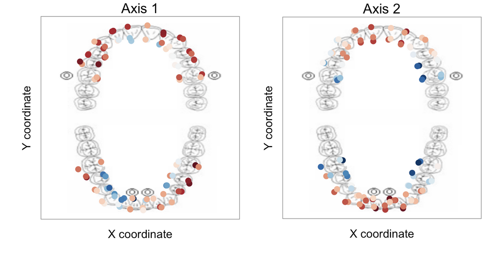
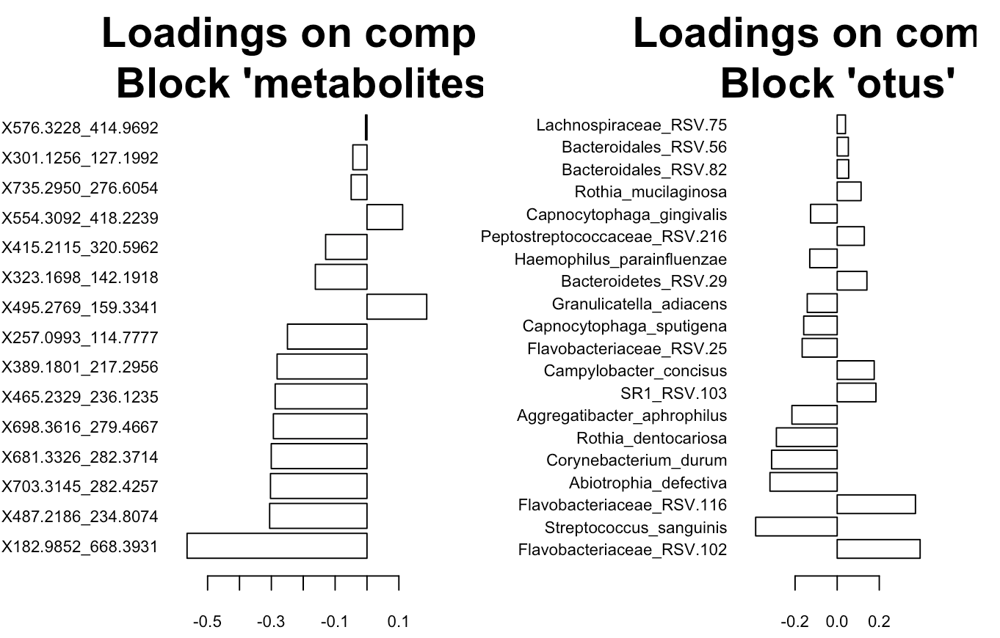
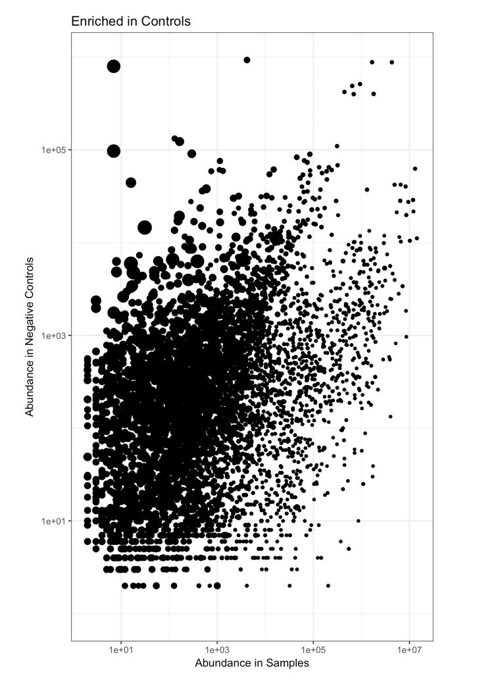

## Spatial ecology of the human microbiome

<strong>Application to the oral microbiota</strong>

We applied multivariate spatial methods (trend surface analysis, moran's eigenvector maps, etc.) to the microbiome, identifying a spatial gradient in the communities that inhabit the oral cavity. These methods can be used broadly to investigate the spatial ecology of communities at any body site or indeed at any site where geographic coordinates (x, y) are obtained. 

The conceptual framework for the application of landscape ecology to the human microbiome is provided. We currently have one manuscript in press at Nature Communications. The link to the text will be provided as soon as the paper is live.

- [Read our review in "Cell Host and Microbe"](http://www.cell.com/cell-host-microbe/fulltext/S1931-3128(17)30121-X)    
- [See my code on github](https://github.com/dmap02/Spatial-Gradients-Oral-Microbiome)   
 
 

## Multi-omics analysis of the oral microbiome in 3D   

  
We are currently mapping the spatial distribution of metabolites and microbes across the oral cavity in 3D, performing a survey of molecular cartography. This work builds on the 2D analysis, both by taking a multi-omics perspective and by integrating the third dimension (X, Y, Z) into the analysis, allowing us to more accurately model the relationships between microbial communities at different intra-oral sites. 

- [See my code on github](https://github.com/dmap02/Molecular-Cartography)      

 
 

## Contamination of high throughput sequence data    

Our ability to make inferences about the bacteria that inhabit the human body and the relationship of these to different disease states depends critically on our ability to accurately identify the presence or absence of organisms in different samples. Suprisingly, most "negative controls" have a large number of taxa at varying abundances, making it difficult to ascertain which taxa are indigenous to any given community. To contend with the issue of contamination for my dissertation, I developed a script to deconvolute contaminants using enrichment scores, providing a rational way to filter these taxa from samples. Ben Callahan led an effort to turn this project into an R package.    

- [Read about the significance of the problem](https://microbiomejournal.biomedcentral.com/articles/10.1186/s40168-016-0172-3)
- [Read our arxiv preprint](https://doi.org/10.1101/221499)    
- [See the code I wrote to calculate Enrichment scores](http://hyposalivation.org/wp-content/uploads/2018/01/DeContaminate-enrichment-1.html)    

 
 

## Reproducible Research    

One of the greatest challenges facing scientists today is the ability to replicate research findings. Associated challenges acknowledged by most include making the data and scripts used to analyze data publically available. Additional challenges are inherent in the maturation of any data processing pipeline as the investigator moves from exploratory analysis to publication. Dedicating oneself to minimizing these challenges is the responsibility of every researcher.   

- [Read my blog post for the Stanford CEHG department](https://stanfordcehg.wordpress.com/2014/01/09/using-phyloseq-for-the-reproducible-analysis-of-high-throughput-sequencing-data-in-microbial-ecology/)
- [Read our paper](http://www.worldscientific.com/doi/abs/10.1142/9789814749411_0018)
- [See the code I contributed to the conference paper](http://statweb.stanford.edu/~susan/papers/TeethRR.html)

 

