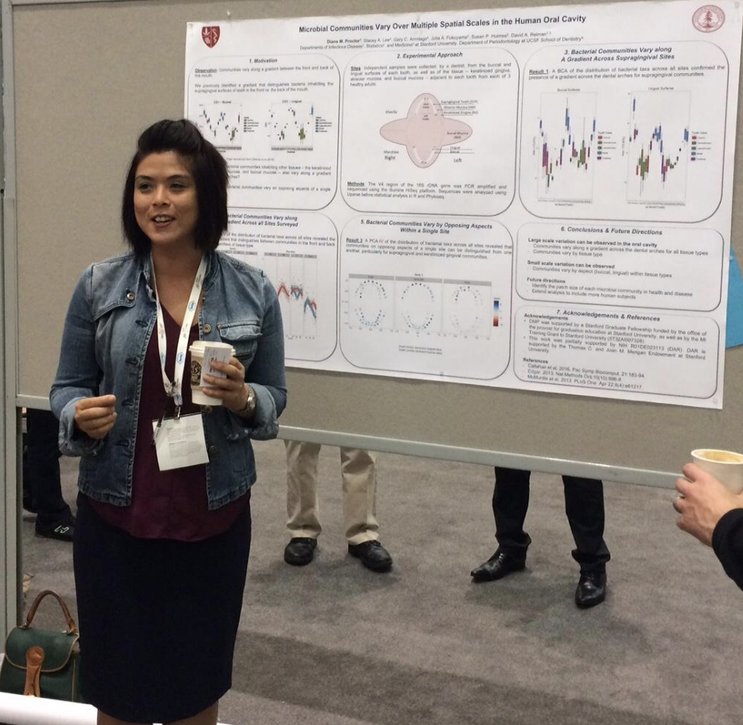

I'm currently a second year postdoctoral fellow in the Division of Infectious Disease and Geographic Medicine at Stanford University. I'm co-advised by David Relman and Susan Holmes, and I also have an appointment as an adjunct clinical instructor (volunteer) in the Department of Orofacial Sciences at the UCSF School of Dentistry.

I spend a lot of time thinking about how spatial patterns inform processes in the context of the human microbiota. So far, I have examined the role that saliva plays in shaping the spatial organization of bacteria in the human oral cavity. I'm eager to apply the principles of spatial ecology to the study of microbial inhabitants of other human body sites or even to hosts other than humans. As a student of Susan Holmes I have come to be dedicated to the principles of reproducible science. I am also passionate about teaching and mentoring. 

In my free time, you can find me searching the rocky shore for [nudibranchs](http://eol.org/pages/2538/overview) or hiking, sometimes with a big bag.

<a href="mailto:diana.proctor@stanford.edu">Email Me</a>   

[Access my CV](https://cap.stanford.edu/profiles/viewCV?facultyId=19711&name=Diana_Proctor)

