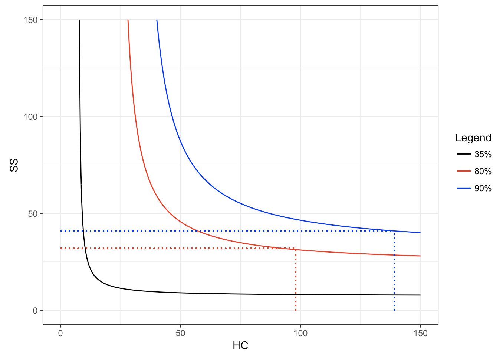
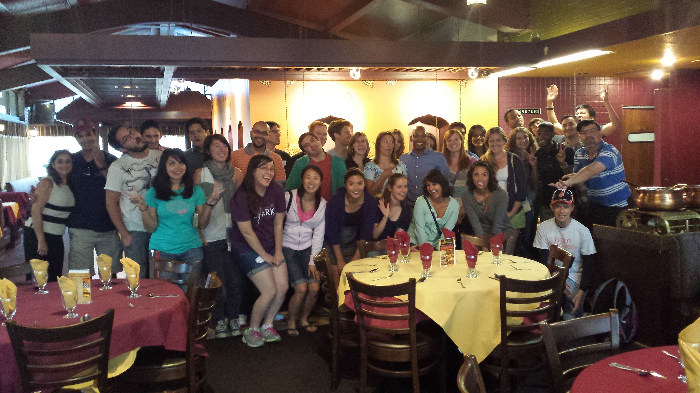
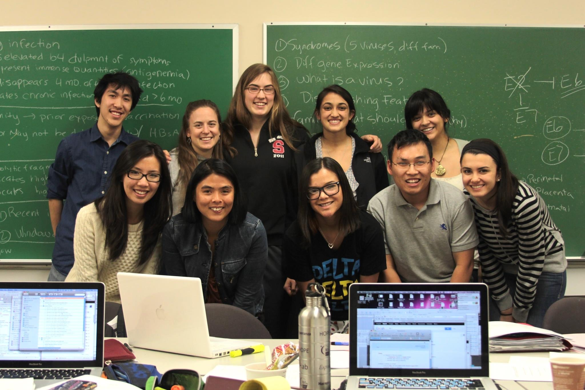
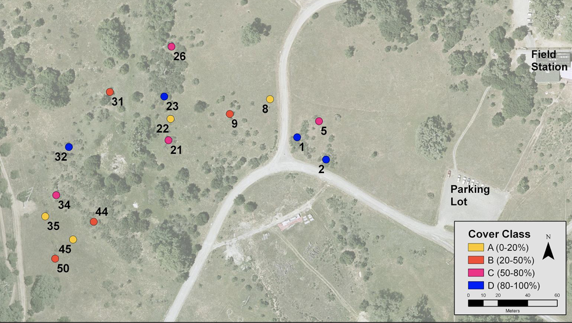

## Teaching and Learning Quantitative Skills in R    

I believe we learn best by doing, and data analysis provides an avenue for teaching and learning quantitative skills. Under the guidance of [Nick Horton](https://www.amherst.edu/people/facstaff/nhorton) and [Susan Holmes](http://statweb.stanford.edu/~susan/), I gained intermediate competency in biostatistics with R, and I have been passionate about sharing that competency with others. I have trained 4 individuals (a technician, a dentist, a high school student, and a study coordinator) who had no prior experience programming how to use R to solve a variety of different problems. Examples of work these individuals undertook with me are provided. 

- [Power Analysis](SamuelWalker-PowerCalculations.html) 
- [Sam Poster](https://www.facebook.com/brushwithucsf/photos/a.508465669348620.1073741828.508188532709667/698045417057310/?type=3&theater)
- [Contamination](ContaminationProject.html)    
- [Tidy data 1](FelixChen_TidyingClinicalData.html)   
- [Tidy data 2](SwethaKanukula-TidyingClinicalData.html)       

 
 

## Preparing students for graduate school

I am passionate about helping students to develop the soft skills that are required for the navigation of a successful career in the scientific enterprise. As a graduate student, I worked part time for the Stanford Biosciences *ADVANCE* Summer Institute, a program designed to facilitate the transition of under-represented students into graduate work at Stanford. Together with the *ADVANCE* team, I investigated the impact that the program has on the social and academic preparedness of matriculating graduate students. Ultimately, I see myself running similar versions of this program, helping students to acquire the soft skills needed to become successful scientists, whether in industry or in academia.

- [Read our Abstract](https://www.aaas.org/abstract/stanford-advance-novel-program-transitioning-bioscience-students-graduate-school)   

 

## Teaching Experience

### Virology
I led discussion sections for the Human Virosphere (MI 216) at Stanford University. In addition, I lectured during section for Humans & Viruses (MI 155A / MI 155B) at Stanford. The image to the right was taken after the final review session for the yearlong course Humans & Viruses. Students in that course asked me to lecture, during section, since they were having a difficult time assimilating the information that was presented in the course. To help students organize the information they were responsible for remembering, I developed a series of section sheets where students could record information during lecture. These sheets were meant to serve as study guides to facilitate student integration of course material. A sample of these materials is provided:

- [See my Molecular Biology review handout for virology students](MoBioRev_Notes.pdf)
- [See my section 1 materials on the DNA Viruses of Humans](Virology_Section1_shortened.pdf)
 
 

### Ecology

I also had the opportunity to lecture once per week for the field ecology course required of all Biology majors at Stanford (Bio44Y, Stanford). Over the course of the quarter, ~45 students collected and analyzed data from experimental field plots (shown in the image on the right) to examine the impact of herbivory, among other factors, on the woody encroachment of *Baccharis pilularis* into grasslands at the Jasper Ridge Biological Preserve. In addition to grading problem sets, I critiqued student lab reports, which were meant to be written in the form of a scientific manuscript, giving students the opportunity to improve their final reports. Student evaluations for this course are available upon request.

- [Example #1 of feedback given on a student lab report for Bio 44Y (ecology)](student_report.pdf)
- [Example #2 of feedback given on a student lab report for Bio 44Y (ecology)](StudentReport2.pdf)

 
 

## Teaching Interests
I'm interested in teaching lecture or discussion-based courses in virology, science writing, statistics for biology with R, and the scientific enterprise. I am also prepared to teach project-based microbiology courses.
